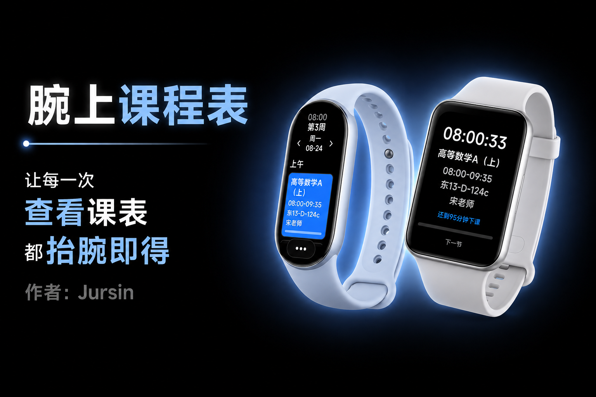
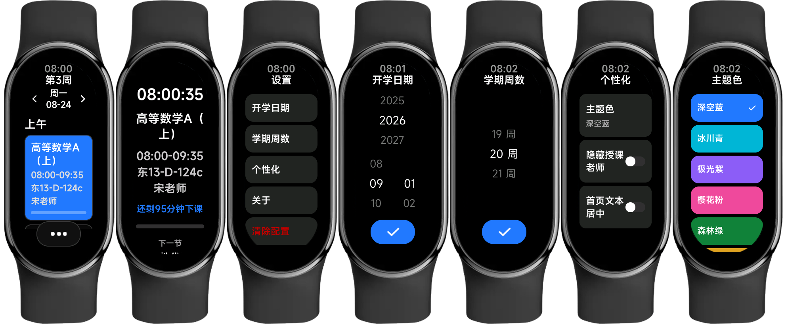
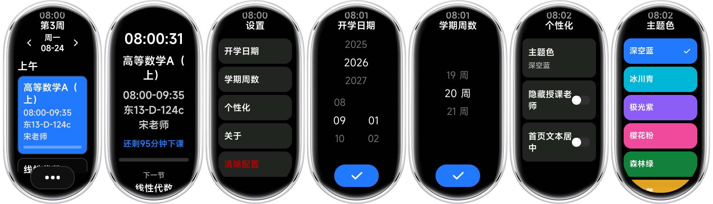
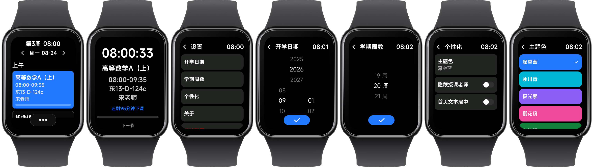

<div align="center">


# Schedule Vela 腕上课程表

一款适用于 Xiaomi Vela OS 操作系统的课程表快应用，让每一次查看课表都抬腕即得



</div>

## ✨ 功能特性
- 以卡片形式显示每日课程及详细信息
- 用主题色高亮正在进行的课程卡片
- 每日课程分时间段显示
- 可自由切换显示上/下一天课程
- 点击课程卡片进入全屏显示
- 显示上/下课倒计时和进度条
- 上课时详情页显示下一节课课程和教室
- 支持首页文本居中、地点前添加@、隐藏授课老师等偏好
- 支持多种预设主题色
- 支持导入[拾光课程表](https://sgschedule.jursin.top/)、[WakeUp 课程表](https://www.wakeup.fun/)、[星链课表](https://pd.qq.com/g/pd81186469)和 [CSES](https://cloud.smart-teach.cn/) 的配置文件

## 🖼️ 预览图
### Xiaomi-Band


### Xiaomi-Band-10


### Xiaomi-Band-Pro


## 📥 安装方式

[](https://astrobox.online/open?source=resv2&id=com.schedule.vela&provider=OfficialV2)

[](https://api.bandbbs.cn/wftools/bandbbs.html?code=A&state=1855993)

> [!note]
> 导入课表需通过 AstroBox 插件或[同步器 APP](https://github.com/Jursin/Schedule-Sync/releases/latest)，详情请阅读[文档](https://blog.jursin.top/blog/tutorials/schedule-vela.html)

## 💻 开发
- 环境：Node.js
- 安装依赖
  ```
  npm install
  ```
- 首次开发：初始化示例课表
  ```
  cp examples/example-schedule.example.json examples/example-schedule.json
  ```
- 代码检查与格式化
  ```
  npm run lint   # eslint 检查并自动修复
  npm run format # prettier 一键格式化
  npm run check  # prettier 格式检查
  ```
- 调试
  ```
  npm run start
  ```
- 构建
  ```
  npm run build
  ```
- 发布
  ```
  npm run release
  ```

## 🤔 常见问题
### 为什么没有编辑课表功能？
穿戴设备屏幕小，不方便操作，且手机端编辑好后导入更高效，所以短期内不考虑实现。

### 为什么应用不能放在首页小组件页面？
官方没开放实现方式，我也没办法。

### 手机端同步器能不能添加编辑课表功能？
没必要。可以在 WakeUp课程表、拾光课程表、CSES Cloud 编辑好课表后导入，重复造轮子无意义。

### 可以适配小爱课程表导入吗？
暂不考虑。现在小爱课程表难以打开，且没有导出配置文件的功能。手动适配难度大、收益低，如果一定要使用建议直接使用相关衍生项目。

### 可不可以适配其它设备？
本快应用根据 Xiaomi Vela JS 应用开发文档开发，理论上支持文档提到的[小米 Vela 穿戴设备](https://iot.mi.com/vela/quickapp/zh/guide/multi-screens/)。但除了小米手环 9 实机测试过，其它设备只在模拟器上测试过，实机安装可能有点小瑕疵。

## 📦 相关仓库
- 同步器 AstroBox v2 插件：[Jursin/Schedule-AstroBox-Plugin](https://github.com/Jursin/Schedule-AstroBox-Plugin)
- 同步器 APP：[Jursin/Schedule-Sync](https://github.com/Jursin/Schedule-Sync)

## 📖 参考
- [Xiaomi Vela JS 应用开发文档](https://iot.mi.com/vela/quickapp)

## 📄 许可证

本项目采用 [GPL-3.0](LICENSE) 许可证
